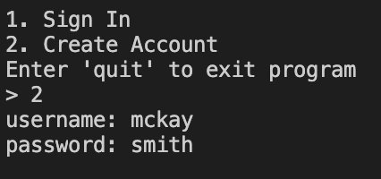
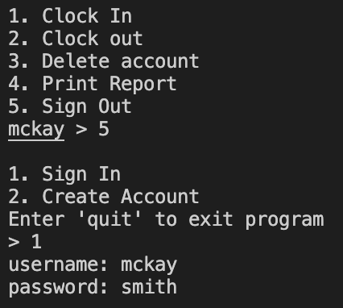

# Description
 Program allows users to create an account to keep track of their time clocks. They can clock in and clock out. Sign in and sign out. Delete an account. And display everyone's time clocks.

# Development Environment
* Visual Studio Code
* Python 3.6.8

# Execution
To execute the program: `Python3 main.py`
 
or
 
click "run" button

Can't create an account. 

Users can clock in and clock out. 

Users can sign in and sign out. 

Users can Delete account. 

# Useful Sites
* [FireBase Documentation](https://firebase.google.com/docs/firestore)
